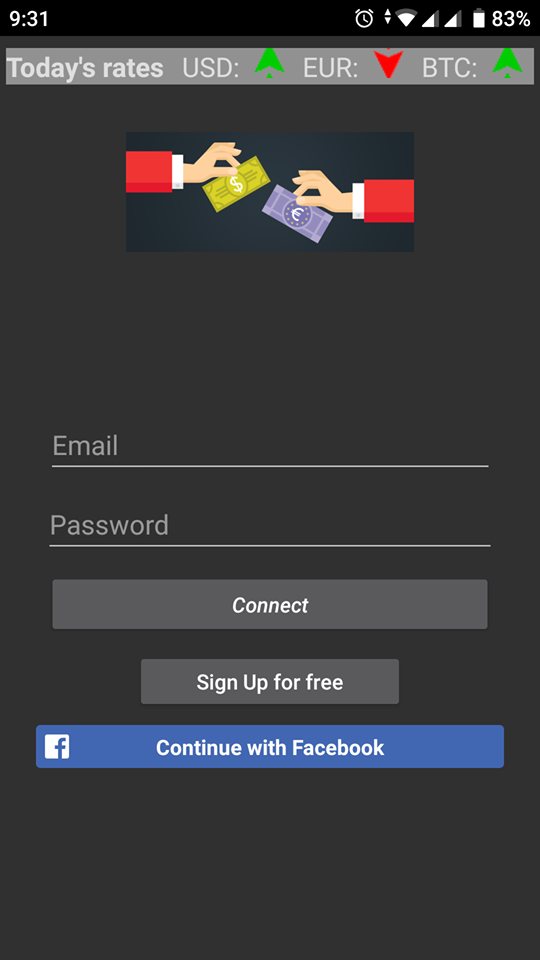
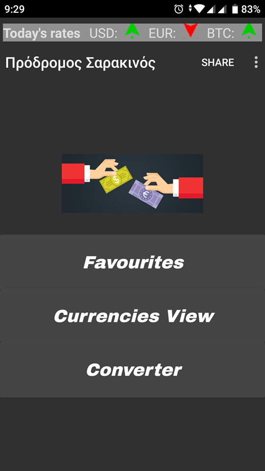
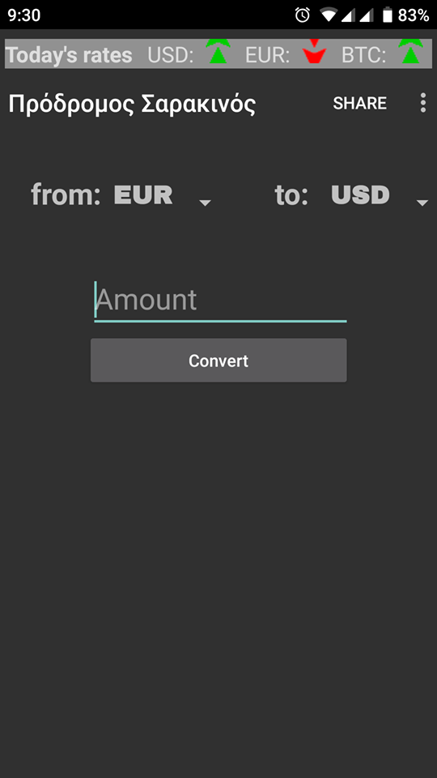

# CurrencyConverter
Currency Converter apk, first steps in programming  
First steps in mobile Development
 
<b>PROJECT's Images</b>

A.
</img>
B. 
</img> 
C.   
</img> 

 
Technologies Used:
 
*Rest Api for currency convert
*Rest Api for currencies List
*Firebase Firestore
*Firebase authentication with email/password
*Facebook Authentication
